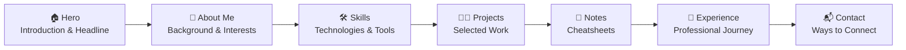

# 👨‍💻 Sravan Tummalapalli — Developer Portfolio

> *"Code is poetry — I write mine with purpose, performance, and creativity."*


Welcome to my personal developer portfolio repository. This project highlights my work, technical skills, and development journey through a modern, responsive, and interactive web experience.

🌐 **Live Portfolio:** [sravantummalapalli.vercel.app](https://sravantummalapalli.vercel.app/)

<!--
📸 Add a hero screenshot here once available, e.g.:
<p align="center">
  
</p>
-->

---

## 📋 Table of Contents

- [About This Project](#-about-this-project)
- [Features](#-features)
- [Site Map](#-site-map)
- [Tech Stack](#️-tech-stack)
- [Project Structure](#-project-structure)
- [Installation & Setup](#️-installation--setup)
- [Portfolio Sections](#-portfolio-sections)
- [Design Philosophy](#-design-philosophy)
- [Deployment](#-deployment)
- [Contact](#-contact)

---

## 🚀 About This Project

This portfolio is designed to represent my professional journey as a developer. Instead of a static resume, this website provides an interactive platform where visitors can explore my projects, skills, and experience.

The main objectives of this portfolio are:

- Showcase my **technical skills and development projects**
- Provide recruiters with a **quick overview of my abilities**
- Demonstrate **modern frontend development practices**
- Deliver a **smooth and engaging user experience**

---

## ✨ Features

| | |
|---|---|
| 🎨 **Modern UI Design** | Clean and minimal interface designed with usability and aesthetics in mind |
| 🌗 **Dark / Light Mode** | Switch between themes for better readability and comfort |
| 📱 **Fully Responsive** | Optimized for desktop, tablet, and mobile devices |
| ⚡ **Smooth Animations** | GSAP-powered interactions that enhance the browsing experience |
| 🧭 **Smooth Navigation** | Well-structured sections with intuitive navigation |
| 🧑‍💻 **Project Showcase** | Each project includes description, tech used, live demo & source links |
| ⚡ **Fast Performance** | Optimized Vite build for quick load times |

<!--
📸 Add feature screenshots here, e.g. dark/light mode side by side:
<p align="center">
  
</p>
-->

---

## 🗺️ Site Map



---

## 🛠️ Tech Stack

| Category | Technology |
|---|---|
| Frontend | React |
| Language | TypeScript |
| Styling | Tailwind CSS |
| Build Tool | Vite |
| Animations | GSAP |
| Package Manager | npm |
| Deployment | Vercel |
| Version Control | Git + GitHub |

---

## 📂 Project Structure

```text
Portfolio/
│
├── public/                 # Static assets
│
├── src/
│   ├── components/         # Reusable UI components
│   ├── pages/              # Main sections of the portfolio
│   ├── assets/             # Images, icons, graphics
│   ├── styles/             # Global styles
│   └── main.tsx            # Application entry point
│
├── index.html              # Root HTML file
├── package.json            # Project dependencies
├── vite.config.ts          # Vite configuration
├── tailwind.config.ts      # Tailwind configuration
└── README.md               # Project documentation
```

---

## ⚙️ Installation & Setup

### 1️⃣ Clone the repository

```bash
git clone https://github.com/SravanTummalapalli/Portfolio.git
```

### 2️⃣ Navigate to the project directory

```bash
cd Portfolio
```

### 3️⃣ Install dependencies

```bash
npm install
```

### 4️⃣ Run the development server

```bash
npm run dev
```

The project will run at:

```
http://localhost:5173
```

---

## 📸 Portfolio Sections

The portfolio contains the following sections:

- **Hero Section** — Introduction and headline
- **About Me** — Overview of my background and interests
- **Skills** — Technologies and tools I work with
- **Projects** — Selected development projects
- **Notes** — Cheatsheets of different topics
- **Experience** — Overall professional journey of mine
- **Contact** — Ways to connect with me

<!--
📸 A screenshot per section works great here, e.g.:
<p align="center">
  
</p>
-->

---

## 🎯 Design Philosophy

My approach to frontend development focuses on:

- Writing **clean and maintainable code**
- Designing **user-centered interfaces**
- Ensuring **fast performance**
- Maintaining **accessibility and responsiveness**
- Creating **simple yet engaging experiences**

I believe that great user interfaces should feel **natural, intuitive, and fast.**

---

## 🌍 Deployment

This portfolio is deployed using **Vercel**, which provides:

- Fast global content delivery
- Continuous deployment
- Reliable hosting

Every push to GitHub can automatically trigger a new deployment.

---

## 📬 Contact

If you would like to collaborate, discuss opportunities, or connect:

- **GitHub:** [github.com/SravanTummalapalli](https://github.com/SravanTummalapalli)
- **Portfolio Website:** [sravantummalapalli.vercel.app](https://sravantummalapalli.vercel.app/)

---
